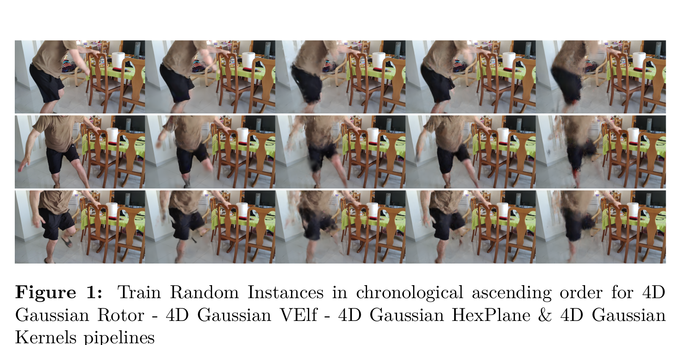
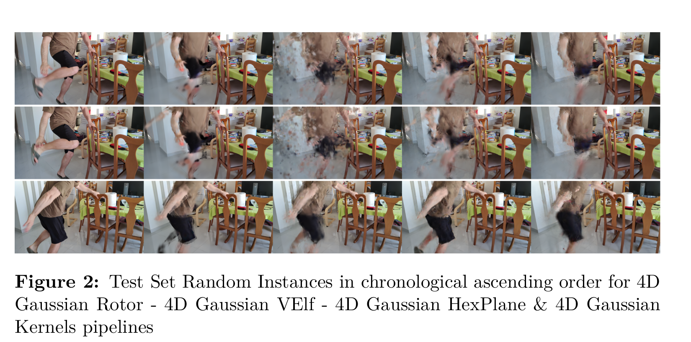
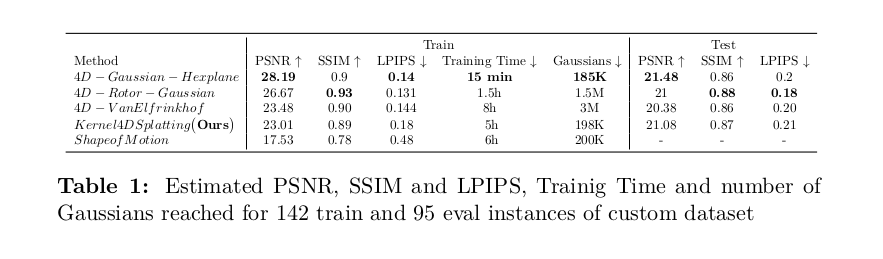

## kernel_4D_splatting

This repo is built on top of
[4D_Gaussians](https://github.com/hustvl/4DGaussians) and provides an
alternative for better generalization during inference regarding novel view
synthesis from bounded monocular videos.  A conditioned to time hybrid
deformation network comprised of a
[HexPlane](https://github.com/Caoang327/HexPlane) representation and swallow
MLPs predicts the position rotation and scaling deformations of a set of
canonical Gaussians. The deormed Gaussians are then splatted and optimization
proceeds.

The term **kernel** in our framework comes from the kernel function that we
utilize during feature interpolation.  Specifically following
[GTK](https://openaccess.thecvf.com/content/CVPR2024/papers/Zhao_Grounding_and_Enhancing_Grid-based_Models_for_Neural_Fields_CVPR_2024_paper.pdf)
we avoid HexPlane features bilinear interpoaltion as was performed in
`4DGaussians`.  Instead a [Multiplicative Filter
Network](https://openreview.net/forum?id=OmtmcPkkhT) is employed as a
**kernel/similarity** function of the combined features.

## Pipeline

## Installation
```
conda env create --name kernel_splatting python=3.10
conda activate kernel_splatting
conda install pytorch==2.4.0 torchvision==0.19.0 torchaudio==2.4.0 pytorch-cuda=12.4 -c pytorch -c nvidia
pip install requirements.txt
```
Regarding submodules directory we have made the following additions
1. **diff-gaussian-rasterization-mip**
    Instead of the standard [GS](https://github.com/graphdeco-inria/gaussian-splatting) pipeline we use
    [mip splatting](https://arxiv.org/abs/2311.16493) that we have implemented on top of the vanilla one
    in submodules/diff_gaussian_rasterization_mip.
2. **weighted_sampling_mfn_CUDA**
    We provide a grid sampling module that performs non-linear interpolation from the processed grids 
    during the forward pass and backpropagates the gradients to both the grids and Gaussian coordinates.
3. **mfn_CUDA_softmax**
    The aforementioned kenrel function that provides the non-linear interpolation is a 2-layer **MFN** network.
    To accelerate training performance we have created custom CUDA kernels for estimating MFN's  `output` as well as 
    loss gradients with respect to network parameters. Moreover, we provid the `Jacobian` as well since it is required
    during Gaussians cords gradient estimation in **2**.
4. **grid_indexing**
    mfn network is activated not only with the Gaussian coords but the row and column indices that define the location where they are projected. 
    That being said this is a helper module written in C++ and OpenMP to further accelerate this indexing procedure.
```
conda activate kernel_splatting
cd submodules
cd diff_gaussian_rasterization_mip
python setup.py build_ext --inplace
cd ../simple_knn
python setup.py build_ext --inplace
cd ../weighted_sampling_mfn_softmax_CUDA
python setup.py build_ext --inplace
cd ../mfn_softmax_CUDA
python setup.py build_ext --inplace
cd ../grid_indexing
python setup.py build_ext --inplace
```
If you are interested in the performance of our `mfn_softmax` network, navigate
to [mfn_CUDA](https://github.com/panospaschalidis/mfn_CUDA), where there are
time comparisons with our custom CUDA kernels and pytorch automatic
differentiation.

## Data 
From the available monocular videos  [CVD](https://roxanneluo.github.io/Consistent-Video-Depth-Estimation/), [DAVIS](https://davischallenge.org/), [NVIDIA](https://gorokee.github.io/jsyoon/dynamic_synth/), [Google](https://augmentedperception.github.io/deepviewvideo/) we selected `DAVIS` and `NVIDIA` as these are the only ones
which correspond to actual dynamic motion fields. We tested our method and baselines to even more challenging 
custom scenes as seen below in [Training](## Training) and [Evaluation](## Evaluation).
To model your own scenes or any scene from the above datasets do the following.
```
1. Install [COLMAP](https://colmap.github.io/install.html) following the designated guidelines.
2. Store your let us say `video_name.mp4` video at `videos` directory and then run
```
bash custom_colmap.sh **video_name**
```
This command will create a subdirectory `video_name` inside `data/custom` directory that formulates
data in the same style as in [NeRFies](https://github.com/google/nerfies).

Now you are ready to run our model.
## Baselines
All our baselines are 4D Gaussian Splatting frameworks that employ different strategies 
to achieve novel view synthesis
1. [4D-Gaussian-HexPlane](https://github.com/hustvl/4DGaussians)
Pretty similar to ours with main difference in HexPlane interpolation.
2. [4D-Gaussian-Rotor](https://github.com/weify627/4D-Rotor-Gaussians)
Employing geometric algebra rotors to model 4D rotations in order to create an actual 4D representaion
that can be optimized though bayesian probalistic identities.
3. [4D-Gaussian-VanElfrinkof](https://github.com/fudan-zvg/4d-gaussian-splatting)
Same with former baseline with only difference in the way they model 4D rotations. Van 
Elfrinkof formula is used for this cause.
4. [Shape-of-Motion](https://github.com/vye16/shape-of-motion/)
A whole differnet approach where a canonical set is deformed from frame to frame based on
optimizable SE3 motion bases i.e. rotations and translations.

## Training
```
python train.py -s data/custom/**video_name** --port 6017 --expname "custom/**video_name**" --configs arguments/custom/custom.py
```
We experimented with even more challenging dymamic scenes such as the one presented below.
Results were similar in terms of all metrics in the remaining two datasets. That is why we have included
only the most challenging one, where we can see a man dancing "Pentozali".


HexPlane is by far the most dominant during training as it tends to overfit extremely as a grid based model.
Surprisingly enough worst performance is demonstreated by `ShapeofMotion` both quantitatively (see below) and qualitatively(Table 1).

which was somehow expected as it is mostly focused on tracking and less to novel view synthesis.
## Evaluation
```
python render.py --model_path output/CVD/**video_name** --skip_train --configs arguments/custom/custom.py
```


Shape of motion utilizes the whole video sequence during training, thus there
is no room left for inference.  The [Iphone](https://github.com/KAIR-BAIR/dycheck) dataset and the modified [NVIDIA](https://github.com/gaochen315/DynamicNeRF)
12-frame dataset are special versions of dynamic scenes where static rigs of
cameras were used to capture the scene. That being said when they refer to
novel view synthesis they consider as novel view, a novel viewpoint for an
already seen timestamp.  In our case we consider each timestamp as part of the
camera parameters. Model can not see info for every timestamp and is challenged
to accomodate the imposed difficulties.

Concerning metrics computation posterior to a 14000 iterations optimization run the
following
```
python metrics.py --target output/custom/**video_name**/test/ours_14000/gt/ --predicted output/custom/**video_name**/test/ours_14000/renders/
```

